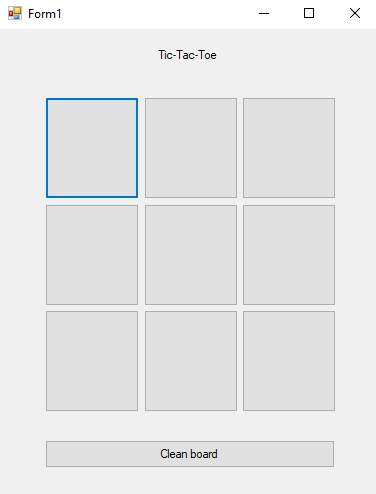
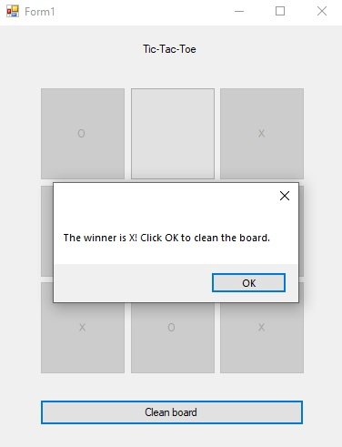

# Tic-Tac-Toe
> A simple game of tic-tac-toe to play with a friend.

## Table of Contents
* [General Info](#general-information)
* [Technologies Used](#technologies-used)
* [Screenshots](#screenshots)
* [Features](#features)
* [Setup](#setup)
* [Usage](#usage)
* [Project Status](#project-status)
* [Room for Improvement](#room-for-improvement)

## General Information
The repository conatins code for a game of tic-tac-toe.
It's a fairly simple app made with in Visual Studio, that was created and uploaded for educational purposes.

## Technologies Used
- C# Window Forms 

## Screenshots

## Features
- An interactive board to place your symbol.
- Winner annoucement notification.
- Tie annoucement notification.

## Setup
Simply dowload the file and open with a programme, preferably VS.

## Usage
Tap on the board to display your symbol in it. Don't forget that the O always starts!

## Project Status
Project is: _complete_ .

## Room for Improvement
The project might be imporved one day.

Room for improvement:
- Better looking UI
